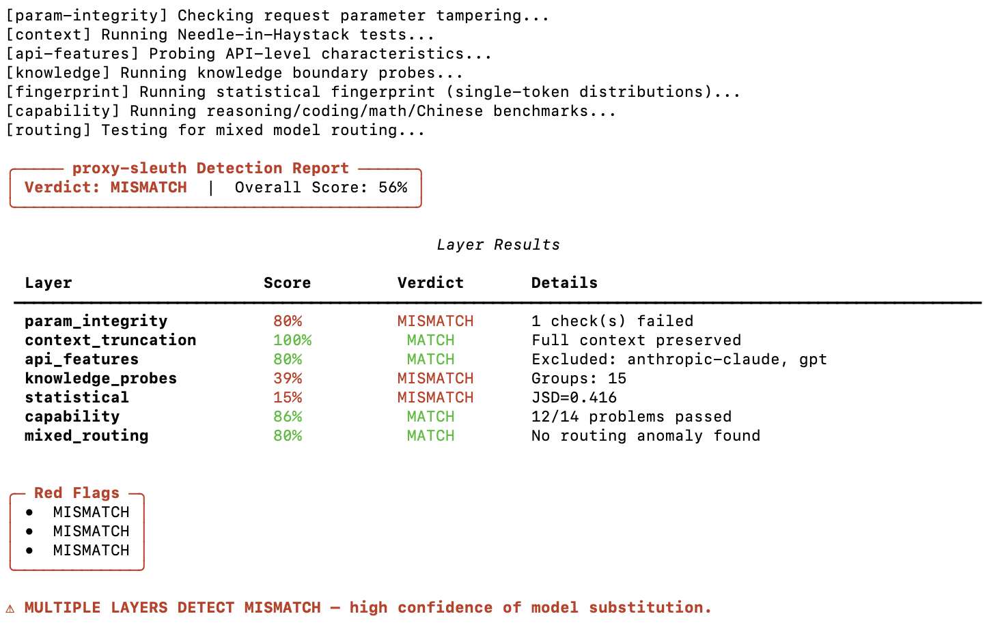

# proxy-sleuth

> Detect fake LLM APIs. Catch proxy services that substitute cheaper models.

**proxy-sleuth** is a CLI tool that verifies whether an LLM API proxy is really serving the model it claims. 7-layer forensic analysis: knowledge probes, statistical fingerprinting, API parameter fingerprints, execution-verified benchmarks, and more.



## Quick Start

```bash
pip install -e .
```

### Test any API endpoint

```bash
proxy-sleuth detect \
  -e https://your-proxy.example.com/v1 \
  -m gpt-5.6-sol \
  -k sk-your-key
```

### CC Switch integration (zero config)

```bash
# Auto-discover your CC Switch providers and test the active one
proxy-sleuth cccswitch test
```

### Baseline fingerprints (for new models)

```bash
# Collect a genuine fingerprint when a model is too new for the DB
proxy-sleuth baseline collect -e https://api.openai.com/v1 -m gpt-5.7 -k sk-xxx

# List collected baselines
proxy-sleuth baseline list
```

## Detection Layers

| Layer | What it detects | Mode |
|-------|----------------|------|
| **param-integrity** | max_tokens reduction, reasoning downgrade, temperature locking, tool stripping, system prompt injection | quick+ |
| **context** | Context truncation via Needle-in-Haystack (~25K tokens, 200 rounds of realistic dialogue) | standard+ |
| **api-features** | DeepSeek-exclusive params (min_p, top_a), Anthropic compat, tool calling, streaming | quick+ |
| **knowledge** | 40+ probes across 15 groups: timestamp events +穿帮 + llm-verify | quick+ |
| **fingerprint** | Statistical fingerprint — 176-model database (Jensen-Shannon divergence) | quick+ |
| **capability** | Execution-verified coding/math/reasoning/Chinese benchmarks with subprocess sandbox | full |
| **routing** | Mixed routing detection: quality inversion + fact inversion (3× repetition) | full |

### Mode presets

```bash
--mode quick        # knowledge + fingerprint + api-features + param-integrity
--mode standard     # quick + context truncation
--mode full         # all 7 layers
--mode knowledge    # knowledge probes only
--mode params       # parameter integrity only
--mode context      # context truncation only
--mode features     # API features only
--mode fingerprint  # statistical fingerprint only
--mode capability   # capability benchmarks only
--mode routing      # mixed routing only
```

## Requirements

- Python 3.11+
- Node.js 18.17+ (for statistical fingerprint layer; vendored copy included — no npm install needed)

```bash
pip install -e ".[dev]"  # includes pytest
```

## API Key

Set via `--api-key` / `-k` or the `PROXY_SLEUTH_KEY` environment variable. CC Switch users: key is auto-read from `~/.cc-switch/cc-switch.db`.

## How It Works

```
Claimed model: GPT-5.5 ($7.78 per 1M tokens)
Your cost:      1/50th of official price (via proxy)

proxy-sleuth investigates:
  ↓
[param-integrity]  Are your request params intact?
[context]          Is your full conversation preserved?
[api-features]     min_p accepted? → DeepSeek, not GPT
[knowledge]        Knows events it should? Doesn't know things it shouldn't?
[fingerprint]      JSD=0.43 — statistical mismatch against 176 models
[capability]       Can it execute correct code in sandbox?
[routing]          Simple fails but complex passes? → model switch detected
  ↓
Verdict: MISMATCH — multi-layer evidence of model substitution
```

## Documentation

- [Design Document](docs/DESIGN.md) — full architecture and design rationale
- [Data Freshness Guide](docs/MAINTENANCE.md) — keeping probes and params up to date
- [Architecture & Contributing](docs/ARCHITECTURE.md) — project structure, adding new layers
- [FAQ](docs/FAQ.md) — common questions and troubleshooting

## Tests

```bash
pytest tests/ -v     # 33 tests covering all detectors + scorer
```

## License

MIT
